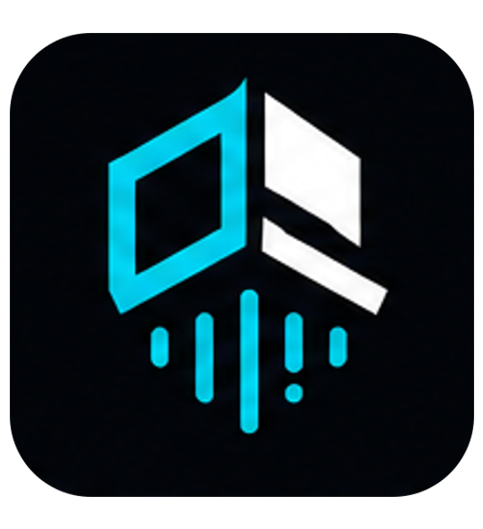
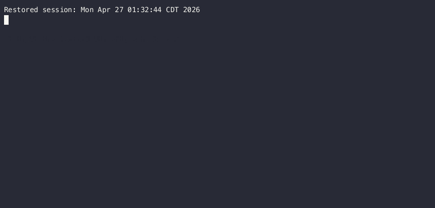

<p align="center">
  
</p>
<p align="center"><strong>Find risky code, AI-agent vulnerabilities, and supply-chain issues before they ship.</strong></p>
<p align="center"><a href="https://shipsafecli.com">Website</a> · <a href="https://shipsafecli.com/docs">Docs</a> · <a href="https://shipsafecli.com/pricing">Pricing</a> · <a href="https://shipsafecli.com/blog">Blog</a></p>

<p align="center">
  <a href="https://www.npmjs.com/package/ship-safe"></a>
  <a href="https://www.npmjs.com/package/ship-safe"></a>
  <a href="https://github.com/asamassekou10/ship-safe/actions/workflows/ci.yml"></a>
  <a href="https://opensource.org/licenses/MIT"></a>
  <a href="https://github.com/asamassekou10/ship-safe/stargazers"></a>
  <a href="https://github.com/sponsors/asamassekou10"></a>
</p>

## Ship Safe

Ship Safe is an AI security scanner for modern software teams. It runs locally in your repo, finds issues across application code, AI agents, MCP configs, prompts, dependencies, CI/CD, secrets, and cloud-adjacent configuration, then helps you review and apply safe fixes.

Start a scan with one command:

```bash
npx ship-safe
```

No signup. No API key required for scanning. Works offline for core checks.

<p align="center">
  
</p>

---

## Quick Start

```bash
# Interactive REPL: scan, fix, and ask questions in one session
npx ship-safe

# Full audit: secrets + 29 agents + deps + remediation plan
npx ship-safe audit .

# Interactive fix agent: plan, diff, approve, verify
npx ship-safe agent .
npx ship-safe agent . --severity critical   # critical findings only
npx ship-safe agent . --branch --pr         # fix on a branch + open a PR

# Undo the last fix
npx ship-safe undo

# CI/CD mode
npx ship-safe ci . --threshold 80 --sarif results.sarif
```

## What Ship Safe Finds

| Area | Examples |
|------|----------|
| AI and LLM security | Prompt injection, agent hijacking, excessive agency, memory poisoning, RAG poisoning, unsafe tool calls |
| MCP and agent configs | Over-broad tool permissions, poisoned registries, untrusted transports, dangerous allowlists |
| Application security | SQL/NoSQL injection, XSS, SSRF, auth bypass, path traversal, insecure API routes |
| Secrets and compliance | API keys, tokens, credentials, PII, leaked secrets in git history |
| Supply chain | Typosquatting, dependency confusion, risky install scripts, unpinned AI actions |
| CI/CD | Pipeline poisoning, unpinned GitHub Actions, secret logging, unsafe workflow triggers |

## How It Works

1. **Scan locally** - Ship Safe inspects your repo with targeted agents and skips checks that do not apply.
2. **Review findings** - Findings include severity, file location, evidence, and recommended remediation.
3. **Fix with control** - The agent proposes a plan and diff, asks before writing, verifies the result, and keeps changes reversible.
4. **Gate in CI** - Use `ship-safe ci` to fail risky builds and upload SARIF into GitHub code scanning.

<p align="center">
  
</p>

---

## Why Developers Use It

- **Built for AI-native apps**: catches risks in agents, MCP servers, prompts, RAG flows, managed-agent configs, and AI-powered CI.
- **Fast local feedback**: run it before a PR, during review, or inside CI without sending code to a hosted scanner.
- **Fixes are reviewable**: every suggested change is shown as a diff before it touches your files.
- **Works with your stack**: JavaScript, TypeScript, Python, config files, infrastructure files, GitHub Actions, and more.
- **Open source core**: MIT-licensed CLI with docs, examples, and a growing agent system.

## Free CLI, Paid Team Workflows

The open-source CLI is the fastest way to scan any repo locally. Upgrade when you need a hosted workflow around the same scanner:

| Need | Use |
|------|-----|
| Local scans, audits, and agent-assisted fixes | Free CLI |
| Scan history, cloud dashboard, and PDF reports | Pro |
| Shared workspace, PR Guardian, team reports, and collaboration | Team |

Compare plans at [shipsafecli.com/pricing](https://shipsafecli.com/pricing).

---

## Security Agents

All agents run in parallel. Each skips irrelevant projects automatically.

| Agent | Category | What It Detects |
|-------|----------|-----------------|
| **InjectionTester** | Code Vulns | SQL/NoSQL injection, command injection, XSS, path traversal, XXE, ReDoS, prototype pollution |
| **AuthBypassAgent** | Auth | JWT flaws (alg:none, weak secrets), CSRF, OAuth misconfig, BOLA/IDOR, TLS bypass |
| **SSRFProber** | SSRF | User input in fetch/axios, cloud metadata endpoints, internal IPs |
| **SupplyChainAudit** | Supply Chain | Typosquatting, wildcard versions, suspicious install scripts, dependency confusion |
| **ConfigAuditor** | Config | Docker (root user, :latest), Terraform, Kubernetes, CORS, CSP, Firebase, Nginx |
| **SupabaseRLSAgent** | Auth | service_role key in client code, tables without RLS, anon key inserts |
| **LLMRedTeam** | AI/LLM | OWASP LLM Top 10: prompt injection, excessive agency, system prompt leakage |
| **MCPSecurityAgent** | AI/LLM | MCP server misuse, tool poisoning, typosquatting, unvalidated inputs |
| **AgenticSecurityAgent** | AI/LLM | OWASP Agentic AI Top 10: agent hijacking, privilege escalation |
| **RAGSecurityAgent** | AI/LLM | Context injection, document poisoning, vector DB access control |
| **MemoryPoisoningAgent** | AI/LLM | Instruction injection in agent memory files, hidden Unicode payloads (ASI-01, ASI-05) |
| **PIIComplianceAgent** | Compliance | SSNs, credit cards, emails, phone numbers in source code |
| **VibeCodingAgent** | Code Vulns | AI-generated code anti-patterns: no validation, empty catches, TODO-auth |
| **ExceptionHandlerAgent** | Code Vulns | Empty catches, unhandled rejections, leaked stack traces (OWASP A10:2025) |
| **AgentConfigScanner** | AI/LLM | Prompt injection in .cursorrules, CLAUDE.md, malicious Claude Code hooks |
| **MobileScanner** | Mobile | OWASP Mobile Top 10 2024: insecure storage, WebView injection, debug mode |
| **GitHistoryScanner** | Secrets | Leaked secrets in git commit history |
| **CICDScanner** | CI/CD | Pipeline poisoning, unpinned actions, secret logging (OWASP CI/CD Top 10) |
| **APIFuzzer** | API | Routes without auth, mass assignment, GraphQL introspection, debug endpoints |
| **ManagedAgentScanner** | AI/LLM | Claude Managed Agent misconfigs: always_allow policies, unrestricted networking (ASI-03–ASI-07) |
| **HermesSecurityAgent** | AI/LLM | Tool registry poisoning, function-call injection, skill permission drift (ASI-01–ASI-10) |
| **AgentAttestationAgent** | Supply Chain | Unpinned agent versions, missing integrity hashes, unsigned manifests (ASI-10, SLSA L0) |
| **AgenticSupplyChainAgent** | Supply Chain | Over-privileged AI CI actions, OAuth scope creep, unsigned AI webhook receivers (ASI-02, ASI-06) |
| **RobloxSecurityAgent** | Supply Chain | Malicious Roblox/Luau Toolbox assets (runtime asset injection, `rbxassetid://` loaders, `HttpEnabled`, payloads hidden in instance attributes) |
| **ModelScanAgent** | Supply Chain | Code-execution payloads in ML model weights (pickle opcodes in `.pt`/`.pkl`/`.ckpt`), `torch.load` without `weights_only`, scanner-evasion archives (CWE-502, CWE-506) |
| **TrustBoundaryAgent** | Agentic | GhostApproval symlink attacks (config-named links into `~/.ssh`/`~/.aws`/`.env`), repo symlinks escaping the tree, and Friendly Fire run-on-review instructions in agent-read docs (CWE-59, CWE-61) |
| **SlopSquatAgent** | Supply Chain | Hallucinated / phantom package imports (slopsquatting) — bare imports not declared, installed, or builtin, plus known AI-hallucinated names (CWE-1357) |
| **ClickFixAgent** | Supply Chain | ClickFix / fake-CAPTCHA paste-and-run lures (fake error + Win+R/Ctrl+V/command-bar keystrokes, PowerShell cradles) and fake-installer npm lifecycle scripts (CWE-1357, CWE-506) |
| **InstallGuardAgent** | Supply Chain | npm worm behaviors in lifecycle scripts (credential harvesting, env exfiltration, destructive `rm -rf`, obfuscated `node -e`) and weaponized `binding.gyp` node-gyp actions (CWE-506, CWE-829) |

**Post-processors:** ScoringEngine · VerifierAgent (secrets liveness) · DeepAnalyzer (LLM taint analysis)

---

## The REPL

```
$ ship-safe

  ███████╗██╗  ██╗██╗██████╗     ███████╗ █████╗ ███████╗███████╗
  ...

  v9.4.1  ·  DeepSeek  ·  ~/my-project

  /scan to find issues  ·  /agent to fix them  ·  /help for more

shipsafe ›
```

| Command | What it does |
|---------|-------------|
| `/scan` | Re-scan the project |
| `/agent` | Run the interactive fix loop |
| `/findings` | List findings from the last scan |
| `/show <n>` | Full detail on finding n |
| `/plan <n>` | Preview fix plan for finding n (no writes) |
| `/undo [--all]` | Revert the last fix (or all fixes) |
| `/share` | Publish scan report as a public URL (7 days) |
| `/diff` | Show git working-tree diff |
| `/provider <name>` | Switch LLM provider mid-session |
| `/quit` | Exit (also `Ctrl-D` or `Ctrl-C`) |

Anything not starting with `/` is sent to the LLM as a free-form question, with your latest scan results as context.

---

## CI/CD

```yaml
# .github/workflows/security.yml
name: Security Audit
on: [push, pull_request]
jobs:
  security:
    runs-on: ubuntu-latest
    steps:
      - uses: actions/checkout@v4
      - name: Security gate
        run: npx ship-safe ci . --threshold 75 --sarif results.sarif
      - uses: github/codeql-action/upload-sarif@v3
        if: always()
        with:
          sarif_file: results.sarif
```

---

## LLM Support

Works with any provider — auto-detected from environment variables. Use `--provider <name>` to override.

Anthropic · OpenAI · Google · DeepSeek · Groq · Together · Mistral · xAI · Perplexity · Ollama · LM Studio · any OpenAI-compatible endpoint

No API key required for scanning. AI is optional.

---

## Suppress False Positives

```python
password = get_password()  # ship-safe-ignore
```

```gitignore
# .ship-safeignore
tests/fixtures/
docs/
```

---

## Add a Badge

```markdown
[](https://shipsafecli.com)
```

---

## Contributing

1. Fork · add your pattern, agent, or config · open a PR
2. See [CONTRIBUTING.md](./CONTRIBUTING.md)

---

## Sponsors

Ship Safe is MIT-licensed and free forever.

<p align="center">
  <a href="https://github.com/sponsors/asamassekou10">
    
  </a>
</p>

---

## Star History

[](https://star-history.com/#asamassekou10/ship-safe&Date)

---

**Ship fast. Ship safe.** — [shipsafecli.com](https://shipsafecli.com)
