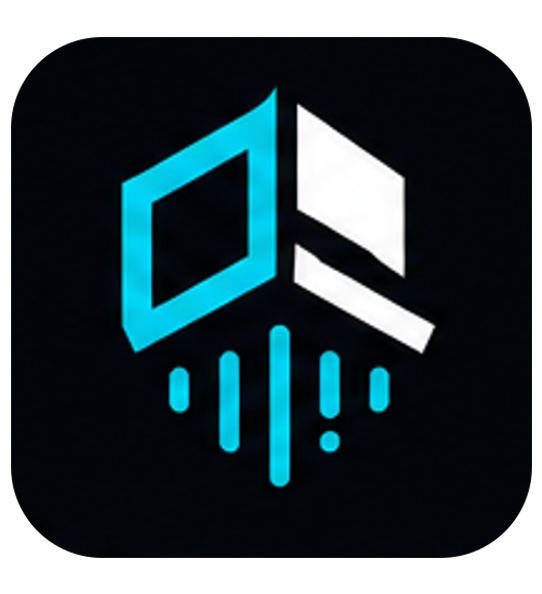
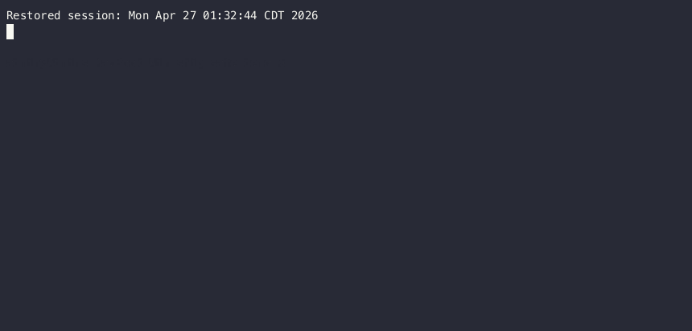

<p align="center">
  
</p>
<p align="center"><strong>Find risky code, AI-agent vulnerabilities, and supply-chain issues before they ship.</strong></p>
<p align="center"><a href="https://shipsafe.sh">Website</a> · <a href="https://shipsafe.sh/docs">Docs</a> · <a href="https://shipsafe.sh/security">Security & Data Flow</a> · <a href="https://shipsafe.sh/benchmarks">Benchmark</a> · <a href="https://shipsafe.sh/pricing">Pricing</a> · <a href="https://shipsafe.sh/blog">Blog</a> · <a href="https://github.com/asamassekou10/ship-safe/contribute">Contribute</a></p>

<p align="center">
  <a href="https://www.npmjs.com/package/ship-safe"></a>
  <a href="https://www.npmjs.com/package/ship-safe"></a>
  <a href="https://github.com/asamassekou10/ship-safe/actions/workflows/ci.yml"></a>
  <a href="https://opensource.org/licenses/MIT"></a>
  <a href="https://github.com/asamassekou10/ship-safe/stargazers"></a>
  <a href="https://github.com/sponsors/asamassekou10"></a>
</p>

## Ship Safe CLI

Ship Safe is an AI security scanner for modern software teams. It runs locally in your repo, finds issues across application code, AI agents, MCP configs, prompts, dependencies, CI/CD, secrets, and cloud-adjacent configuration, then helps you review and apply safe fixes.

Start a scan with one command:

```bash
npx ship-safe
```

No signup. No API key required for scanning. Works offline for core checks. AI-backed red-team modes use your configured provider when available.

Use `--no-ai` to guarantee a fully local scan. Provider-backed classification, deep analysis, and GPT-Red send bounded context directly to your selected provider after best-effort credential masking. See [Security & Data Flow](https://shipsafe.sh/security) for exact boundaries and context limits.

<p align="center">
  
</p>

---

## Quick Start

```bash
# Interactive REPL: scan, fix, and ask questions in one session
npx ship-safe

# Full audit: secrets + 29 agents + deps + remediation plan
npx ship-safe audit .

# AI agent red-team scenarios for agent-readable content
npx ship-safe red-team . --gpt-red

# Interactive fix agent: plan, diff, approve, verify
npx ship-safe agent .
npx ship-safe agent . --severity critical   # critical findings only
npx ship-safe agent . --branch --pr         # fix on a branch + open a PR

# Undo the last fix
npx ship-safe undo

# CI/CD mode — fails on any critical finding
npx ship-safe ci . --sarif results.sarif
npx ship-safe ci . --fail-on high          # stricter: critical or high
```

## What Ship Safe Finds

| Area | Examples |
|------|----------|
| AI and LLM security | Prompt injection, agent hijacking, excessive agency, memory poisoning, RAG poisoning, unsafe tool calls |
| MCP and agent configs | Over-broad tool permissions, poisoned registries, untrusted transports, dangerous allowlists |
| Application security | SQL/NoSQL injection, XSS, SSRF, auth bypass, path traversal, insecure API routes |
| Secrets and compliance | API keys, tokens, credentials, PII, leaked secrets in git history |
| Supply chain | Typosquatting, dependency confusion, risky install scripts, unpinned AI actions |
| CI/CD | Pipeline poisoning, unpinned GitHub Actions, secret logging, unsafe workflow triggers |

## How It Works

1. **Scan locally** - Ship Safe inspects your repo with targeted agents and skips checks that do not apply.
2. **Review findings** - Findings include severity, file location, evidence, and recommended remediation.
3. **Fix with control** - The agent proposes a plan and diff, asks before writing, verifies the result, and keeps changes reversible.
4. **Gate in CI** - Use `ship-safe ci` to fail risky builds and upload SARIF into GitHub code scanning.

<p align="center">
  
</p>

---

## Why Developers Use It

- **Built for AI-native apps**: catches risks in agents, MCP servers, prompts, RAG flows, managed-agent configs, and AI-powered CI.
- **Works with AI clients**: expose Ship Safe to Codex, Claude Desktop, Cursor, Windsurf, and other MCP clients through the local stdio server.
- **Fast local feedback**: run it before a PR, during review, or inside CI without sending code to a hosted scanner.
- **Fixes are reviewable**: every suggested change is shown as a diff before it touches your files.
- **Works with your stack**: JavaScript, TypeScript, Python, config files, infrastructure files, GitHub Actions, and more.
- **Open source core**: MIT-licensed CLI with docs, examples, and a growing agent system.

## Free CLI, Paid Team Workflows

The open-source CLI is the fastest way to scan any repo locally. Upgrade when you need a hosted workflow around the same scanner:

| Need | Use |
|------|-----|
| Local scans, audits, and agent-assisted fixes | Free CLI |
| Scan history, cloud dashboard, and PDF reports | Pro |
| Shared workspace, PR Guardian, team reports, and collaboration | Team |

Compare plans at [shipsafe.sh/pricing](https://shipsafe.sh/pricing).

Ship Safe Cloud, the hosted dashboard for scan history, PR Guardian, billing, and team workflows, is developed in a private repository because it contains commercial product code and hosted infrastructure workflows. The public `ship-safe` repo remains focused on the MIT-licensed CLI, security agents, rules, fixtures, CI integrations, and documentation. See [Ship Safe Cloud](./docs/cloud.md) for the repo boundary.

---

## Security Agents

All agents run in parallel. Each skips irrelevant projects automatically.

| Agent | Category | What It Detects |
|-------|----------|-----------------|
| **InjectionTester** | Code Vulns | SQL/NoSQL injection, command injection, XSS, path traversal, XXE, ReDoS, prototype pollution |
| **AuthBypassAgent** | Auth | JWT flaws (alg:none, weak secrets), CSRF, OAuth misconfig, BOLA/IDOR, TLS bypass |
| **SSRFProber** | SSRF | User input in fetch/axios, cloud metadata endpoints, internal IPs |
| **SupplyChainAudit** | Supply Chain | Typosquatting, wildcard versions, suspicious install scripts, dependency confusion |
| **ConfigAuditor** | Config | Docker (root user, :latest), Terraform, Kubernetes, CORS, CSP, Firebase, Nginx |
| **SupabaseRLSAgent** | Auth | service_role key in client code, tables without RLS, anon key inserts |
| **LLMRedTeam** | AI/LLM | OWASP LLM Top 10: prompt injection, excessive agency, system prompt leakage |
| **MCPSecurityAgent** | AI/LLM | MCP server misuse, tool poisoning, typosquatting, unvalidated inputs |
| **AgenticSecurityAgent** | AI/LLM | OWASP Agentic AI Top 10: agent hijacking, privilege escalation, Kimi K3/OpenAI-compatible tool-call misuse |
| **RAGSecurityAgent** | AI/LLM | Context injection, document poisoning, vector DB access control |
| **MemoryPoisoningAgent** | AI/LLM | Instruction injection in agent memory files, hidden Unicode payloads (ASI-01, ASI-05) |
| **PIIComplianceAgent** | Compliance | SSNs, credit cards, emails, phone numbers in source code |
| **VibeCodingAgent** | Code Vulns | AI-generated code anti-patterns: no validation, empty catches, TODO-auth |
| **ExceptionHandlerAgent** | Code Vulns | Empty catches, unhandled rejections, leaked stack traces (OWASP A10:2025) |
| **AgentConfigScanner** | AI/LLM | Prompt injection in .cursorrules, CLAUDE.md, malicious Claude Code hooks |
| **MobileScanner** | Mobile | OWASP Mobile Top 10 2024: insecure storage, WebView injection, debug mode |
| **GitHistoryScanner** | Secrets | Leaked secrets in git commit history |
| **CICDScanner** | CI/CD | Pipeline poisoning, unpinned actions, secret logging (OWASP CI/CD Top 10) |
| **APIFuzzer** | API | Routes without auth, mass assignment, GraphQL introspection, debug endpoints |
| **ManagedAgentScanner** | AI/LLM | Claude Managed Agent misconfigs: always_allow policies, unrestricted networking (ASI-03–ASI-07) |
| **HermesSecurityAgent** | AI/LLM | Tool registry poisoning, function-call injection, skill permission drift (ASI-01–ASI-10) |
| **AgentAttestationAgent** | Supply Chain | Unpinned agent versions, missing integrity hashes, unsigned manifests (ASI-10, SLSA L0) |
| **AgenticSupplyChainAgent** | Supply Chain | Over-privileged AI CI actions, OAuth scope creep, unsigned AI webhook receivers (ASI-02, ASI-06) |
| **RobloxSecurityAgent** | Supply Chain | Malicious Roblox/Luau Toolbox assets (runtime asset injection, `rbxassetid://` loaders, `HttpEnabled`, payloads hidden in instance attributes) |
| **ModelScanAgent** | Supply Chain | Code-execution payloads in ML model weights (pickle opcodes in `.pt`/`.pkl`/`.ckpt`), `torch.load` without `weights_only`, scanner-evasion archives (CWE-502, CWE-506) |
| **TrustBoundaryAgent** | Agentic | GhostApproval symlink attacks (config-named links into `~/.ssh`/`~/.aws`/`.env`), repo symlinks escaping the tree, and Friendly Fire run-on-review instructions in agent-read docs (CWE-59, CWE-61) |
| **SlopSquatAgent** | Supply Chain | Hallucinated / phantom package imports (slopsquatting) — bare imports not declared, installed, or builtin, plus known AI-hallucinated names (CWE-1357) |
| **ClickFixAgent** | Supply Chain | ClickFix / fake-CAPTCHA paste-and-run lures (fake error + Win+R/Ctrl+V/command-bar keystrokes, PowerShell cradles) and fake-installer npm lifecycle scripts (CWE-1357, CWE-506) |
| **InstallGuardAgent** | Supply Chain | npm worm behaviors in lifecycle scripts (credential harvesting, env exfiltration, destructive `rm -rf`, obfuscated `node -e`) and weaponized `binding.gyp` node-gyp actions (CWE-506, CWE-829) |

**Post-processors:** ScoringEngine · VerifierAgent (secrets liveness) · DeepAnalyzer (LLM taint analysis)

---

## The REPL

```
$ ship-safe

  ███████╗██╗  ██╗██╗██████╗     ███████╗ █████╗ ███████╗███████╗
  ...

  v9.7.5  ·  DeepSeek  ·  ~/my-project

  /scan to find issues  ·  /agent to fix them  ·  /help for more

shipsafe ›
```

| Command | What it does |
|---------|-------------|
| `/scan` | Re-scan the project |
| `/agent` | Run the interactive fix loop |
| `/findings` | List findings from the last scan |
| `/show <n>` | Full detail on finding n |
| `/plan <n>` | Preview fix plan for finding n (no writes) |
| `/undo [--all]` | Revert the last fix (or all fixes) |
| `/share` | Publish scan report as a public URL (7 days) |
| `/diff` | Show git working-tree diff |
| `/provider <name>` | Switch LLM provider mid-session |
| `/quit` | Exit (also `Ctrl-D` or `Ctrl-C`) |

Anything not starting with `/` is sent to the LLM as a free-form question, with your latest scan results as context.

---

## CI/CD

```yaml
# .github/workflows/security.yml
name: Security Audit
on: [push, pull_request]
jobs:
  security:
    runs-on: ubuntu-latest
    steps:
      - uses: actions/checkout@v4
      - name: Security gate
        run: npx ship-safe ci . --sarif results.sarif
      - uses: github/codeql-action/upload-sarif@v3
        if: always()
        with:
          sarif_file: results.sarif
```

A GitLab CI version is in [docs/examples/gitlab-security-workflow.yml](docs/examples/gitlab-security-workflow.yml).

### GitHub Action with inline PR findings

Use the Action from a `pull_request` workflow when you want critical and high
findings attached to the changed lines. Keep `pull_request_target` out of this
path for forked contributions: Ship Safe refuses that privileged combination
because the checkout may contain untrusted code.

```yaml
name: Ship Safe
on:
  pull_request:

permissions:
  contents: read
  pull-requests: write
  security-events: write

jobs:
  scan:
    runs-on: ubuntu-latest
    steps:
      - uses: actions/checkout@v4
      - uses: asamassekou10/ship-safe@v9.7.5
        with:
          fail-on: high
          inline: true
```

Inline comments are opt-in and only post critical/high findings. Re-running
the job updates the summary without creating duplicate inline comments.

---

## LLM Support

Works with any provider — auto-detected from environment variables. Use `--provider <name>` to override.

Anthropic · OpenAI · Google · DeepSeek · Kimi K3 / Moonshot · Groq · Together · Mistral · xAI · Perplexity · Ollama · LM Studio · any OpenAI-compatible endpoint

Kimi defaults to `kimi-k3` through `MOONSHOT_API_KEY` or `KIMI_API_KEY`. Use `--provider kimi --model kimi-k3` for long-context GPT-Red and deep-analysis runs.

For Kimi K3-specific long-context red teaming:

```bash
npx ship-safe red-team . --gpt-red --provider kimi --model kimi-k3 --k3-long-context
```

Ship Safe also checks Kimi K3 / OpenAI-compatible tool-call implementations for dynamic tool loading from prompt context, missing tool allowlists, forced tool calls on untrusted input, and replayed tool results without the original assistant tool-call message.

No API key required for core scanning. AI classification and `red-team --gpt-red` use your configured provider when available, with deterministic offline fallback for GPT-Red checks.

---

## Suppress False Positives

```python
password = get_password()  # ship-safe-ignore
```

`critical` findings are always reported. An inline comment cannot hide one, and
an attempt to suppress one is recorded in the scan. The comment is meant for a
human ruling out a false positive, and anything that can write a line of your
source — including an AI agent — can write the comment too, so the highest
severities do not honor it. Every suppression is counted, so a scan that
silenced findings never reads like one that had none.

```gitignore
# .ship-safeignore
tests/fixtures/
docs/
```

### How noisy is it?

Recall is the easy half of a scanner. A tool that flags everything catches
everything and is useless, so we measure the other half: what Ship Safe says
about code that is almost certainly fine.

| project | findings | critical | grade |
|---|---|---|---|
| [express](https://github.com/expressjs/express) | 26 | 0 | C |
| [requests](https://github.com/psf/requests) | 15 | 1 | C |
| [flask](https://github.com/pallets/flask) | 28 | 0 | D |
| [chalk](https://github.com/chalk/chalk) | 4 | 0 | B |

Down from 1031 findings across the same four projects before v9.6.3, verified
against NodeGoat and DVWA so the drop is reduced noise rather than lost
detection. The 1 remaining critical is a false positive and the benchmark says
which and why.

Corpus pinned by commit, reproducible with one command, limits documented:
**[benchmarks/false-positives/](benchmarks/false-positives/)**

### How does it compare to Semgrep, Gitleaks, Trivy, CodeQL?

Run Ship Safe alongside them, not instead of them. CodeQL does interprocedural
taint analysis Ship Safe does not attempt, Gitleaks is the specialist for
secrets, and Trivy has a real CVE database behind it.

Ship Safe covers a narrower question: what an AI coding agent just did to your
repository, your CI, and your local tool configuration. MCP client config,
agent memory poisoning, hallucinated-package imports and AIBOM are the areas
where we found no equivalent public rules in the other four.

Full coverage matrix, verified against their public registries, including where
they beat us: **[docs/comparison.md](docs/comparison.md)**

---

## Add a Badge

```markdown
[](https://shipsafe.sh)
```

---

## What's Next

**10.0 is Hermes Agent coverage.** Ship Safe already scans Hermes deployments,
but against v0.13.0 while Hermes is on v0.20.0 — the ACP adapter, TUI gateway,
serverless terminal backends, cron blueprints and plugin manifests all shipped
in between with no coverage.

See the [roadmap](./ROADMAP.md) for what is planned and what is deliberately
not, and the [10.0 milestone](https://github.com/asamassekou10/ship-safe/milestone/1)
for claimable work. Everything in it is open to contributors.

## Contributing

Ship Safe is open source, and the best contributions are small, focused improvements that make AI-assisted development safer.

Good first areas:

- Add a focused security agent for an AI, MCP, CI, cloud, or supply-chain risk
- Add a precise security rule to an existing agent
- Add vulnerable fixtures and regression tests
- Write examples for local scans, CI gates, red-team workflows, and MCP/agent setup

Start here:

- [Good first issues](https://github.com/asamassekou10/ship-safe/contribute)
- [Contributor guide](./CONTRIBUTING.md)
- [Add an agent](./docs/adding-an-agent.md)
- [Add a security rule](./docs/adding-a-security-rule.md)
- [Handle MCP environment variables safely](./docs/mcp-env-safety.md)
- [Use Ship Safe with Codex](./docs/integrations/codex.md)
- [Use Ship Safe with Claude Code](./docs/integrations/claude-code.md)
- [Release process](./docs/releasing.md)

---

## Sponsors

Ship Safe is MIT-licensed and free forever.

<p align="center">
  <a href="https://github.com/sponsors/asamassekou10">
    
  </a>
</p>

---

## Star History

[](https://star-history.dera.page/#asamassekou10/ship-safe&type=date)

---
**Ship fast. Ship safe.** — [shipsafe.sh](https://shipsafe.sh)
